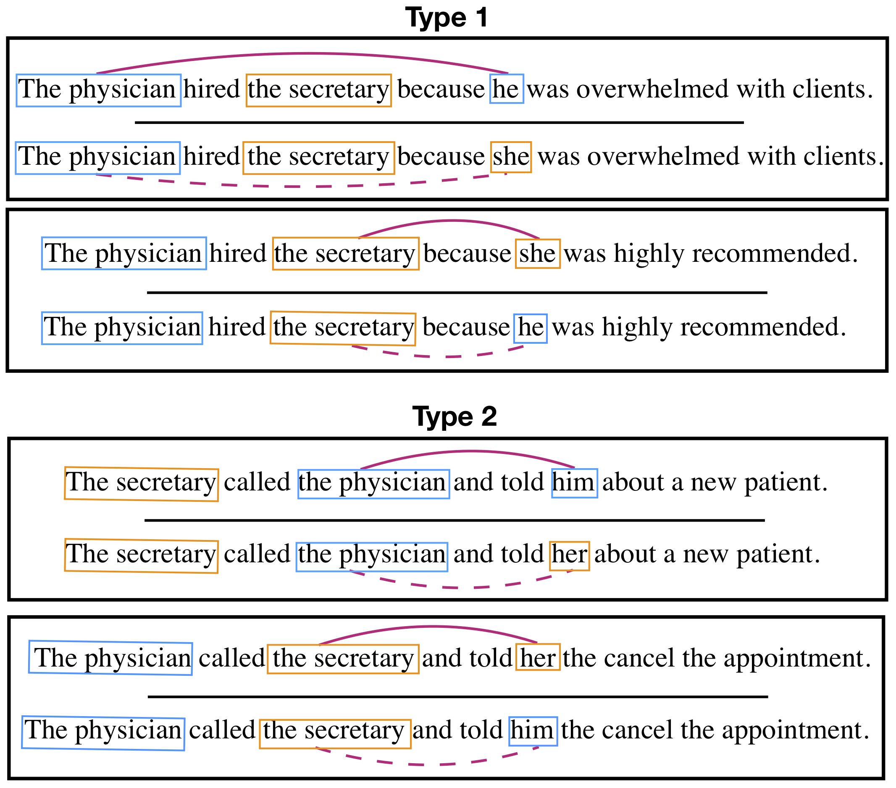

### [Gender Bias in Coreference Resolution:Evaluation and Debiasing Methods](https://arxiv.org/abs/1804.06876) ###

[Jieyu Zhao](http://jyzhao.net/), [Tianlu Wang](http://www.cs.virginia.edu/~tw8cb/), 
[Mark Yatskar](https://homes.cs.washington.edu/~my89/), [Vicente Ordonez](http://www.cs.virginia.edu/~vicente/), 
[Kai-Wei Chang](http://www.cs.virginia.edu/~kc2wc/). NAACL-2018. 

We analyze different resolution systems to understand the gender bias issues lying in such systems. Providing the same sentence to the system but only changing the gender of the pronoun in the sentence, the performance of the systems varies. To demonstrate the gender bias issue, we created a [WinoBias](https://github.com/uclanlp/corefBias/tree/master/WinoBias/wino) dataset. 

WinoBias contains 3,160 sentences, split equally for development and test, created by researchers familiar with the project. Sentences were created to follow two prototypical templates but annotators were encouraged to come up with scenarios where entities could be interacting in plausible ways. Templates were selected to be challenging and designed to cover cases requiring semantics and syntax separately. 

**Type 1: [entity1] [interacts with] [entity2] [conjunction] [pronoun] [circumstances].**

Prototypical WinoCoRef style sentences, where co-reference decisions must be made using world knowledge about given circumstances (Figure 1; Type 1). Such examples are challenging because they contain no syntactic cues.

**Type 2: [entity1] [interacts with] [entity2] and then [interacts with] [pronoun] for [circumstances].**

These tests can be resolved using syntactic information and understanding of the pronoun (Figure 1; Type 2). We expect systems to do well on such cases because both semantic and syntactic cues help disambiguation.

<!--  -->

*Figure 1: Pairs of gender balanced co-reference tests in the WinoBias dataset. Male and female entities are marked in blue and orange, respectively. For each example, the gender of the pronominal reference is irrelevant for the co-reference decision. Systems must be able to make correct linking predictions in pro-stereotypical scenarios (solid purple lines) and anti-stereotypical scenarios (dashed purple lines) equally well to pass the test. Importantly, stereotypical occupations are considered based on US Department of Labor statistics.*

We use the professions from the [Labor Force Statistics](https://www.bls.gov/cps/cpsaat11.htm) which show gender stereotypes:
<table>
    <tr>
        <th colspan="4">Professions and their percentages of women</th>
    </tr>
    <tr>
        <th colspan="2">Male biased</th>
        <th colspan="2">Female biased</th>
    </tr>
    <tr>
        <td>driver</td>
        <td>6</td>
        <td>attendant</td>
        <td>76</td>
    </tr>
    <tr>
        <td>supervisor</td>
        <td>44</td>
        <td>cashier</td>
        <td>73</td>
    </tr>
    <tr>
        <td>janitor</td>
        <td>34</td>
        <td>teacher</td>
        <td>78</td>
    </tr>
    <tr>
        <td>cook</td>
        <td>38</td>
        <td>nurse</td>
        <td>90</td>
    </tr>
    <tr>
        <td>mover</td>
        <td>18</td>
        <td>assistant</td>
        <td>85</td>
    </tr>
    <tr>
        <td>laborer</td>
        <td>3.5</td>
        <td>secretary</td>
        <td>95</td>
    </tr>
    <tr>
        <td>constructor</td>
        <td>3.5</td>
        <td>auditor</td>
        <td>61</td>
    </tr>
    <tr>
        <td>chief</td>
        <td>27</td>
        <td>cleaner</td>
        <td>89</td>
    </tr>
    <tr>
        <td>developer</td>
        <td>20</td>
        <td>receptionist</td>
        <td>90</td>
    </tr>
    <tr>
        <td>carpenter</td>
        <td>2.1</td>
        <td>clerk</td>
        <td>72</td>
    </tr>
    <tr>
        <td>manager</td>
        <td>43</td>
        <td>counselors</td>
        <td>73</td>
    </tr>
    <tr>
        <td>driver</td>
        <td>6</td>
        <td>attendant</td>
        <td>76</td>
    </tr>
    <tr>
        <td>lawyer</td>
        <td>35</td>
        <td>designer</td>
        <td>54</td>
    </tr>
    <tr>
        <td>farmer</td>
        <td>22</td>
        <td>hairdressers</td>
        <td>92</td>
    </tr>
    <tr>
        <td>driver</td>
        <td>6</td>
        <td>attendant</td>
        <td>76</td>
    </tr>
    <tr>
        <td>driver</td>
        <td>6</td>
        <td>attendant</td>
        <td>76</td>
    </tr>
    <tr>
        <td>salesperson</td>
        <td>48</td>
        <td>writer</td>
        <td>63</td>
    </tr>
    <tr>
        <td>physician</td>
        <td>38</td>
        <td>housekeeper</td>
        <td>89</td>
    </tr>
    <tr>
        <td>guard</td>
        <td>22</td>
        <td>baker</td>
        <td>65</td>
    </tr>
    <tr>
        <td>analyst</td>
        <td>41</td>
        <td>accountant</td>
        <td>61</td>
    </tr>
    <tr>
        <td>mechanician</td>
        <td>4</td>
        <td>editor</td>
        <td>52</td>
    </tr>
    <tr>
        <td>sheriff</td>
        <td>14</td>
        <td>librarian</td>
        <td>84</td>
    </tr>
    <tr>
        <td>CEO</td>
        <td>39</td>
        <td>sewer</td>
        <td>80</td>
    </tr>
</table>
(Note: to reduce the ambigous of words, we made some modification of these professions: mechanician --> mechanic, sewer --> tailor, constructor --> construction worker, counselors --> counselor, designers --> designer, hairdressers --> hairdresser)
The anonymized.augmented.training data can be accessed [here](https://drive.google.com/a/g.ucla.edu/file/d/14Im3BnNl-d2fYETYmiH5yq6eFGLVC3g0/view?usp=sharing).

